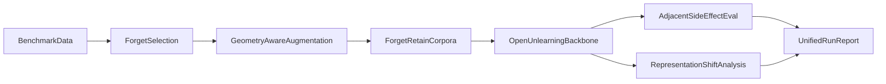

# Unlearning Project Monorepo

This repository unifies the multi-repo workflow for **pre-unlearning geometry-aware data augmentation to mitigate knowledge side effects**.

The monorepo is organized around the experiment lifecycle rather than around historical repositories:

- `configs/`: benchmark and experiment configs
- `scripts/run_pipeline.py`: single pipeline entrypoint
- `unlearning_project/benchmarks/`: benchmark adapters and dataset normalization
- `unlearning_project/augmentation/`: geometry-aware augmentation logic
- `unlearning_project/backbones/open_unlearning/`: wrappers around the OpenUnlearning training/eval backbone
- `unlearning_project/evaluation/`: behavioral and representation-side analysis helpers
- `unlearning_project/pipeline/`: stage orchestration and run manifests
- `runs/`: per-run outputs, configs, corpora, analyses, and reports

## Pipeline



## Current integration

The monorepo currently wraps the existing research assets:

- pre-unlearning forget/retain preparation from `subo-fun/unlearning-data-improvement`
- adjacent side-effect evaluation artifacts and wrappers from `subo-fun/unlearning-adjacent-creation`
- training/eval execution via the external `open-unlearning` repo
- representation-shift analysis via `subo-fun/unlearning-representation-shift`

For now, the OpenUnlearning code itself is treated as an external backbone referenced by config at `/media/volume/llm/open-unlearning`, while this repository owns orchestration, corpora generation, augmentation, and unified reporting.

## Geometry-aware augmentation

The new augmentation stage sits between selection and corpus construction.

Current strategy:

- `geometry_retain_neighbors`: retrieve retain-set neighbors near the forget set in a configurable vector space

Current backends:

- `hashed_ngram`: lightweight local vector-space backend for smoke tests and offline runs
- `transformer_embedding`: mean-pooled transformer embeddings for stronger geometry-aware retrieval

Augmented retain examples are written to `runs/<run_name>/augmentation/augmented_retain.jsonl` with per-example metadata linking each retained sample back to the forget sample that selected it.

## Smoke run

The included smoke config validates one WMDP-Bio vertical slice:

```bash
cd /media/volume/llm/unleraning-project
python scripts/run_pipeline.py --config configs/experiments/wmdp_bio_geometry_smoke.yaml
```

That run will:

1. use the filtered WMDP forget set
2. build geometry-aware retain augmentations
3. prepare merged forget/retain corpora
4. attach an existing WMDP unlearned checkpoint as the model artifact
5. summarize adjacent side-effect results
6. run a small representation-shift analysis
7. write a unified run report under `runs/wmdp_bio_geometry_smoke/`

## Notes

- The benchmark adapters currently support WMDP and TOFU local datasets.
- The WMDP smoke config is the first validated slice because it already has local data and an existing unlearned checkpoint.
- You can override any config value from the CLI with `--set key=value`.
